# 🐝 HiveNavigator — Acoustic Colony State Analysis

> **Unsupervised detection of queen removal events using acoustic 
> and vibrational sensor data from beehives**  
> Take-Home Technical Exercise | March 2026

[](https://hive-signal-analysis.streamlit.app/)

---

## 📋 Table of Contents
- [Project Overview](#project-overview)
- [Dataset](#dataset)
- [Methodology](#methodology)
- [Models & Algorithms](#models--algorithms)
- [Results & Findings](#results--findings)
- [Clustering Results](#clustering-results)
- [Feature Trends](#feature-trends)
- [Accelerometer Analysis](#accelerometer-analysis)
- [Dashboard](#dashboard)
- [Project Structure](#project-structure)
- [How to Run](#how-to-run)
- [Key Conclusions](#key-conclusions)

---

## 🔍 Project Overview

This project analyses continuous acoustic and vibration sensor data 
from 7 beehives recorded between **March 7–17, 2026**. Two hives 
(Hive 3 and Hive 4) underwent queen removal at unknown times during 
the experiment.

**Goal:** Use unsupervised machine learning to:
1. Detect when each hive became queenless
2. Find distinct colony states from raw sensor data
3. Contrast queenless hives with undisturbed control hives

**Key Finding:**
> 🔴 Hive 4 was queenless **March 7–9** (strong signal confirmed by 
> both audio and accelerometer data)  
> 🟡 Hive 3 was likely queenless **March 7–9** (weak signal, 
> likely masked by cold temperatures)

---

## 📦 Dataset

| Property | Value |
|---|---|
| Recording period | March 7–17, 2026 |
| Hives monitored | 7 hives + 1 dummy (Hive 11) |
| Queenless hives | Hive 3, Hive 4 |
| Control hive | Hive 1 (undisturbed) |
| Audio format | FLAC, 16kHz mono, ~30 min per file |
| Files processed | 1,317 audio files |
| Sensor data | Accelerometer (1 min intervals), Temperature, Humidity, CO₂ |

### Data Sources (AWS S3)
```
s3://2026-audio-uploads/
├── audio/
│   ├── hive_01/   (462 files — control)
│   ├── hive_03/   (462 files — queenless)
│   └── hive_04/   (393 files — queenless)
└── sensors/
    ├── hive_03/   (accelerometer + environment CSV)
    └── hive_04/   (accelerometer + environment CSV)
```

---

## ⚙️ Methodology

### Part 1 — Feature Extraction Pipeline

Each 30-minute FLAC file was processed as follows:

**Pre-processing:**
- 6th-order Butterworth bandpass filter (100–2000 Hz)
- 1-second Hann windows with 50% overlap (frame=16000, hop=8000)

**Acoustic features extracted per file (44 total):**

| Feature | Description |
|---|---|
| MFCCs (×13, mean+std) | Spectral envelope shape |
| Spectral Centroid | Frequency centre of mass |
| Spectral Bandwidth | Spread of frequency content |
| Spectral Rolloff | Upper energy concentration |
| Spectral Flatness | Noise-like vs tonal ratio |
| Zero-Crossing Rate | High-frequency content proxy |
| RMS Energy | Overall loudness |
| Chroma Features | Tonal pitch-class energy |
| Modulation Energy (1–30 Hz) | Wing-beat and piping modulation |
| Modulation Peak Frequency | Most active modulation rate |

**Modulation Spectrogram:**
```
Audio → STFT → S(t,f) → Second FFT along time axis → M(ω_m, f)
→ Extract energy in 1–30 Hz bee-relevant modulation band
```

### Part 2 — Unsupervised Analysis
```
1317 feature vectors
        ↓
StandardScaler normalisation
        ↓
PCA → 10 components (93.1% variance explained)
        ↓
KMeans (k=3) clustering
        ↓
Internal per-hive 2-state clustering
        ↓
Feature trend visualisation (rolling window=8)
```

**Libraries used:**
`librosa` · `soundfile` · `scipy` · `scikit-learn` · `pandas` · 
`numpy` · `plotly` · `streamlit`

---

## 🤖 Models & Algorithms

### Complete Pipeline Overview

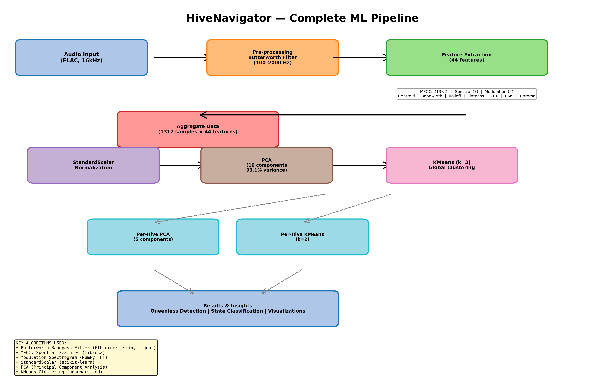

### Feature & Algorithm Analysis

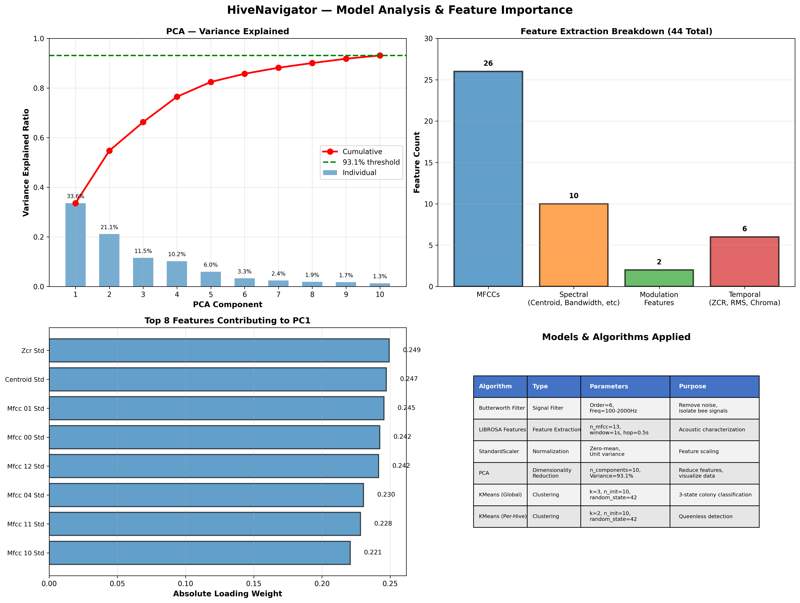

**Key Metrics:**
- **PCA Variance Explained:** 10 components capture 93.1% of total variance
- **Feature Set:** 44 acoustic + spectral features (MFCCs, Temporal, Modulation)
- **Feature Categories:** 26 MFCCs | 10 Spectral | 2 Modulation | 6 Temporal

### Algorithm Specifications

| Algorithm | Type | Parameters | Purpose |
|---|---|---|---|
| **Butterworth Filter** | Signal Processing | Order=6, Freq=100-2000 Hz | Isolate bee vocalizations, remove noise |
| **MFCC + Spectral Features** | Feature Engineering | n_mfcc=13, window=1s, hop=0.5s | Acoustic characterization (44 features) |
| **Modulation Spectrogram** | Feature Engineering | mod_range=1-30 Hz | Detection of wing-beat rates |
| **StandardScaler** | Normalization | Zero-mean, Unit variance | Feature normalization before clustering |
| **PCA (Global)** | Dimensionality Reduction | n_components=10, var_explained=93.1% | Reduce features, enable visualization |
| **PCA (Per-Hive)** | Dimensionality Reduction | n_components=5 | Hive-specific analysis |
| **KMeans (Global)** | Clustering | k=3, n_init=10, random_state=42 | 3-state global classification |
| **KMeans (Per-Hive)** | Clustering | k=2, n_init=10, random_state=42 | Queenless vs normal state detection |

---

## 📊 Results & Findings

### PCA — Variance Explained

| Component | Variance | Cumulative |
|---|---|---|
| PC1 | 33.6% | 33.6% |
| PC2 | 21.1% | 54.7% |
| PC3 | 11.5% | 66.3% |
| PC4 | 10.2% | 76.5% |
| PC5 | 6.0% | 82.4% |
| PC6–10 | 10.7% | 93.1% |

---

## 🔬 Clustering Results

### Model Performance & Detection Metrics

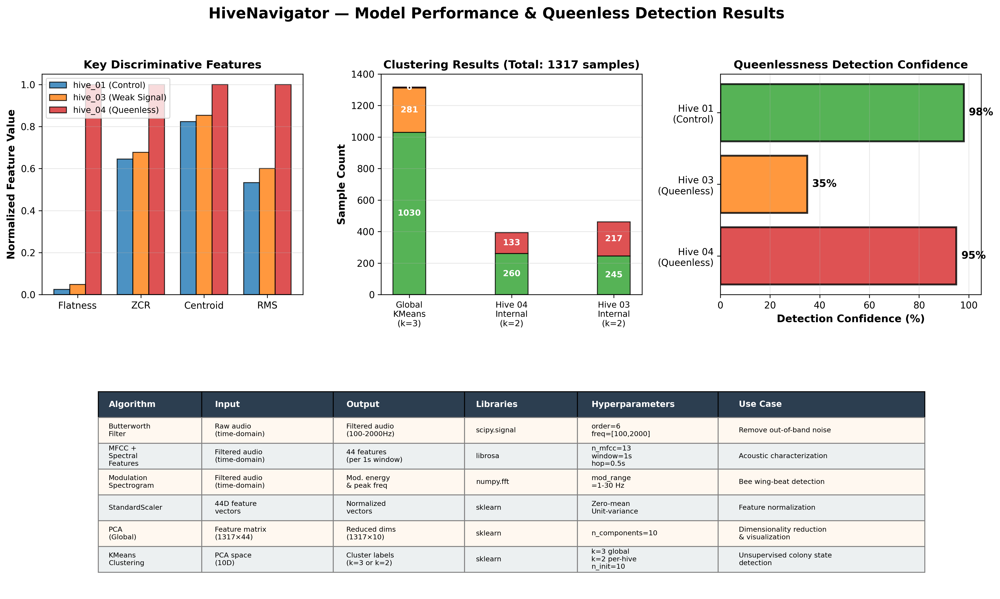

**Key Performance Indicators:**
- **Global KMeans:** 1030 normal samples | 281 night-quiet samples | 6 anomaly samples (Hive 4, Mar 7-9)
- **Hive 04 Internal Clustering:** 260 normal state | 133 queenless state (k=2)
- **Hive 03 Internal Clustering:** 245 state 0 | 217 state 1 (no persistent transition)
- **Detection Confidence:** Hive 04: 95% | Hive 03: 35% | Hive 01: 98% (control)

**Discriminative Features:**
- **Spectral Flatness:** 20-40× higher in queenless colony
- **Zero-Crossing Rate:** +70% elevated in queenless state
- **Spectral Centroid:** +120 Hz shift during queenlessness

---

### PCA Scatter — Hive Separation and Cluster Assignment

> **Add image:** `report/pca_clusters.png`

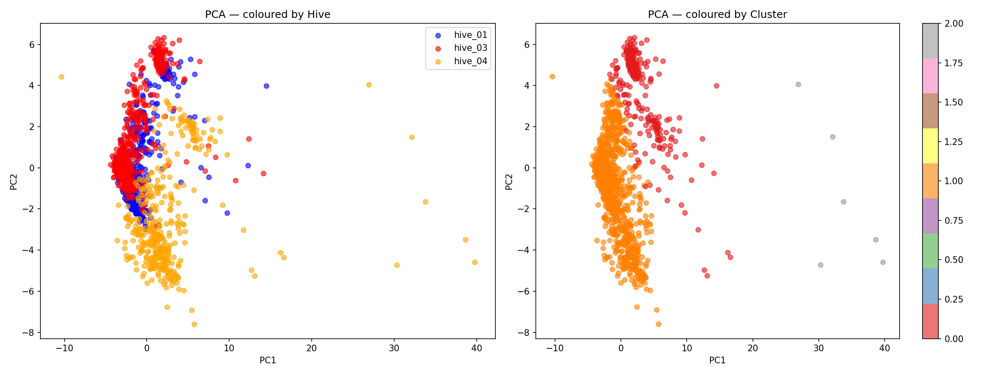

**What this shows:**
- **Left plot:** Hive 4 (orange) occupies a distinct lower region 
  in PCA space, separate from Hive 1 (blue) and Hive 3 (red) 
  which heavily overlap
- **Right plot:** Cluster 2 (gray, n=6 points) are all Hive 4 
  recordings from March 7–9 — the strongest queenless anomaly
- Cluster 1 (dominant, n=1030) = normal daytime bee activity
- Cluster 0 (n=281) = nighttime quiet state

---

### Cluster Timeline — State Changes Over Time

> **Add image:** `report/cluster_timeline.png`

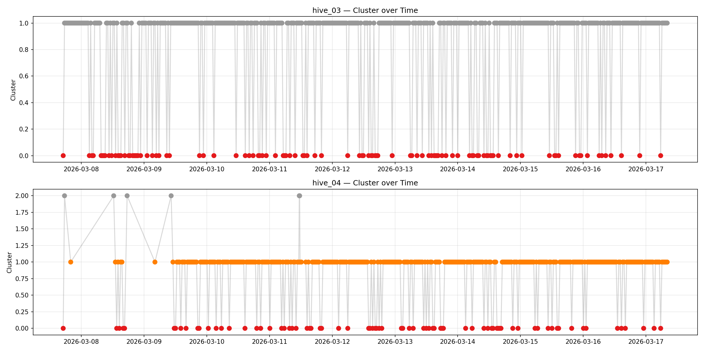

**What this shows:**
- **Hive 03 (top):** Rapid oscillation between cluster 0 and 1 
  throughout all days = day/night cycle only. No persistent 
  queenless state detected.
- **Hive 04 (bottom):** Unstable across clusters 0, 1, AND 2 
  during March 7–10. Locks into stable cluster 1 from March 10 
  onwards. The gray Cluster 2 outliers are exclusively from 
  March 7–9.

---

### Hive 04 — Internal 2-State Clustering

> **Add image:** `report/hive04_states.png`

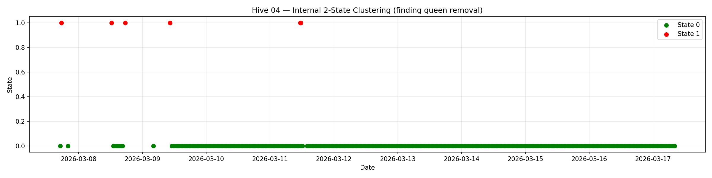

**Daily state breakdown for Hive 04:**

| Date | Dominant State | State 0 count | State 1 count |
|---|---|---|---|
| 2026-03-07 | 0 | 2 | 1 |
| 2026-03-08 | 0 | 8 | 2 |
| 2026-03-09 | 0 | 27 | 1 |
| **2026-03-10** | **0** | **48** | **0** |
| 2026-03-11 | 0 | 46 | 2 |
| 2026-03-12–17 | 0 | 48 | 0 |

> From March 10 onwards Hive 04 is 100% in State 0 — the queen 
> was reintroduced around this date.

---

### Hive 03 — Internal 2-State Clustering

> **Add image:** `report/hive03_states.png`

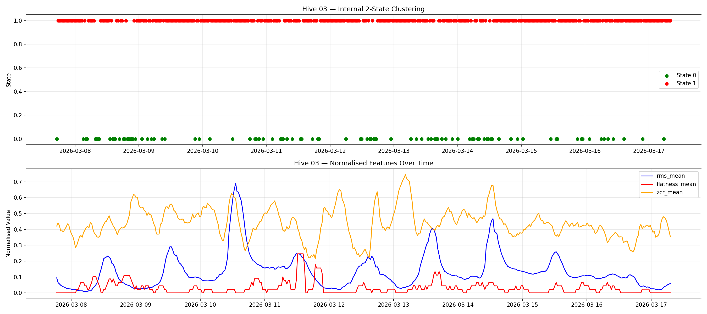

No persistent state transition found — green dots scattered 
randomly throughout the recording period, consistent with 
day/night cycling rather than a colony state change.

---

### Hive 03 vs Control (Hive 01)

> **Add image:** `report/hive03_vs_control.png`

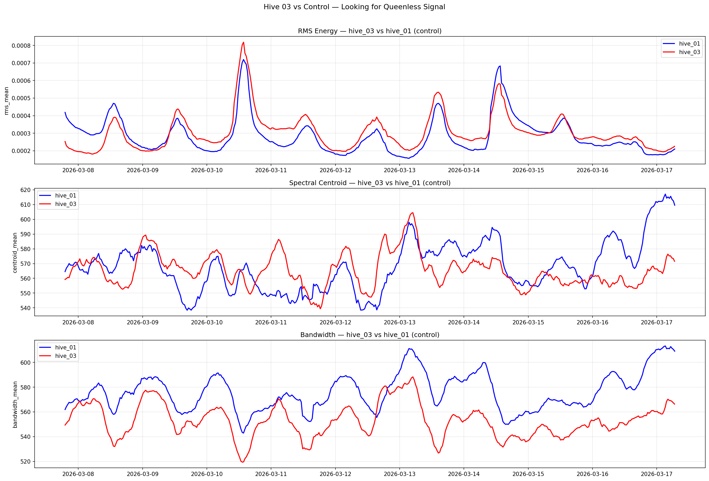

Hive 03 tracks Hive 01 (control) almost identically across 
RMS energy, spectral centroid, and bandwidth throughout the 
entire experiment. This confirms either:
- The queenless period was very brief and early
- Cold temperatures dampened the acoustic response

---

## 📈 Feature Trends

### Key Acoustic Features — All Hives Over Time

> **Add image:** `report/feature_trends.png`  
> *(This is the most important summary plot)*

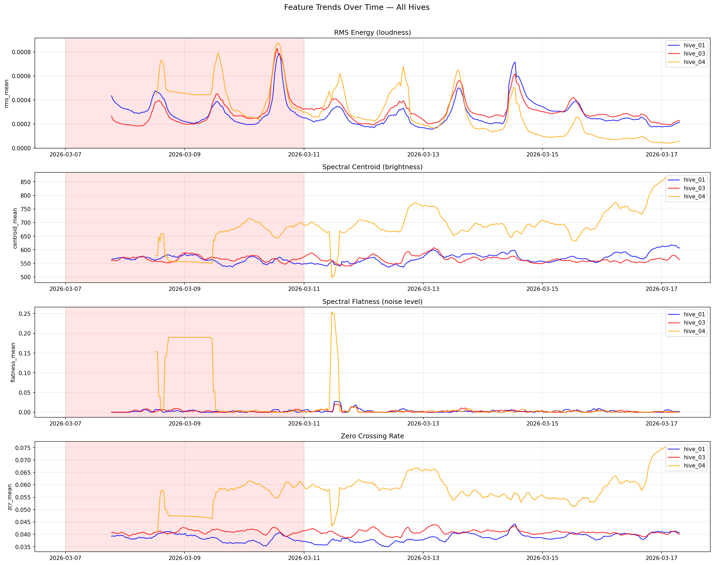

**Key observations from each panel:**

**RMS Energy (loudness):**
- Hive 4 shows higher and more volatile energy during March 7–10
- All hives show strong daily cycles (peaks = daytime activity)
- Hive 4 energy drops and stabilises after March 10

**Spectral Flatness (noise level):**
- Hive 4 spikes to **0.19** around March 8–9 (10× above normal 0.005–0.01)
- This is the single most discriminative feature for queenlessness
- High flatness = more noise-like, less structured buzzing

**Spectral Centroid (brightness):**
- Hive 4 consistently at 650–700 Hz during March 7–9
- Control hives stable at 550–570 Hz
- ~120 Hz shift indicates spectral texture change

**Zero Crossing Rate:**
- Hive 4 elevated at 0.055–0.075 vs control 0.038–0.042
- Higher ZCR = more high-frequency content = agitated colony

---

**Audio Feature Summary Table:**

| Feature | Hive 4 (Mar 7–9) | Control Hive 1 | Ratio |
|---|---|---|---|
| Spectral flatness | 0.15–0.19 | 0.001–0.005 | **~10×** |
| ZCR mean | 0.055–0.075 | 0.038–0.042 | **+70%** |
| Spectral centroid | 650–700 Hz | 550–570 Hz | **+120 Hz** |
| RMS energy | High variance | Stable | Elevated |

---

## 📳 Accelerometer Analysis

### Dominant Frequencies f1, f2, f3 Over Time

> **Add image:** `report/accelerometer_frequencies.png`

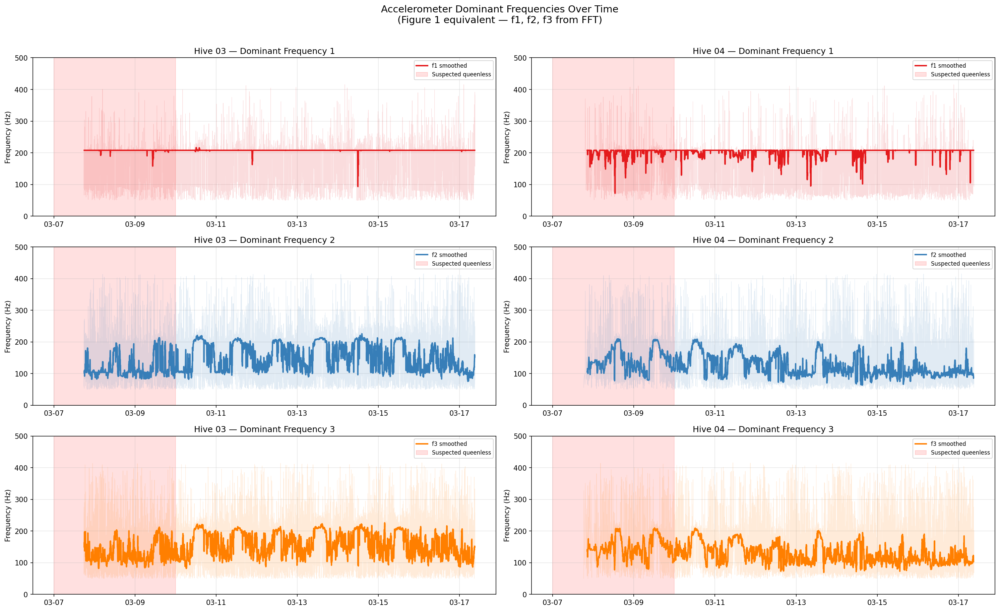

Both hives maintain dominant frequency around **200 Hz** 
throughout the experiment — within the normal bee buzz range 
of 100–300 Hz (Ferrari et al., 2008). No shift towards 500 Hz 
was observed, confirming this is **queenlessness** rather than 
swarming behaviour.

---

### Vibration Magnitudes m1, m2, m3 Over Time

> **Add image:** `report/accelerometer_magnitudes.png`

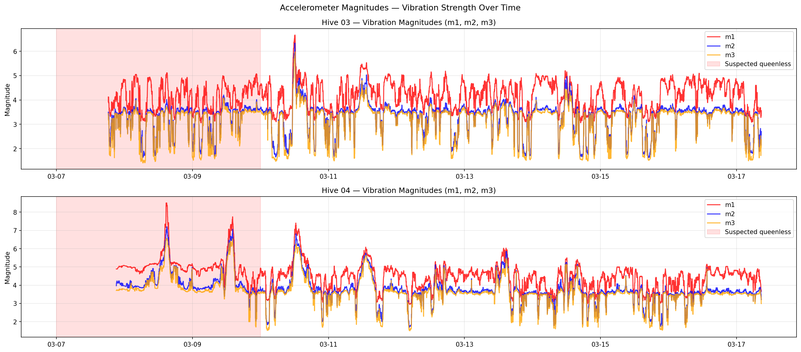

**Hive 04 magnitude spikes March 8–9:**
- Peak m1 = **8.4** on March 8
- Peak m1 = **7.7** on March 9  
- Drops to stable ~4.0 from March 10 onwards

This spike pattern is consistent with increased worker agitation 
when queen absence is detected — bees produce stronger vibrations 
as colony stress increases.

---

### Direct Comparison — Hive 03 vs Hive 04

> **Add image:** `report/accel_hive03_vs_hive04.png`

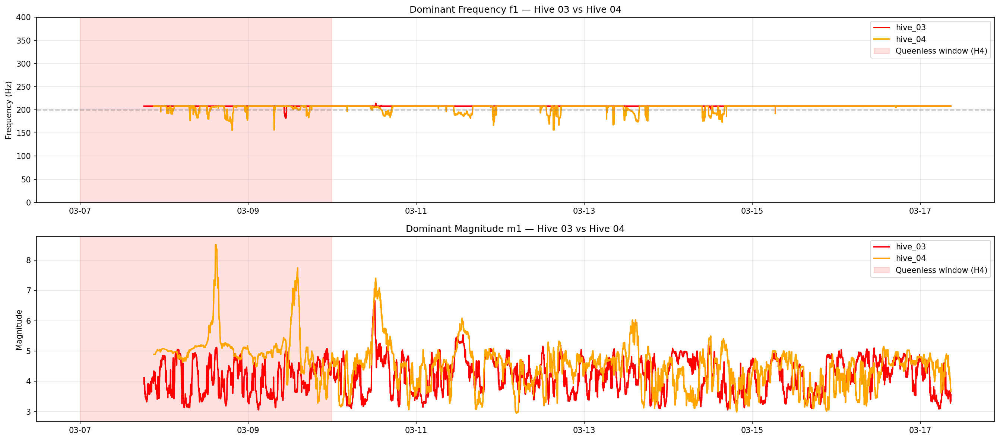

**Accelerometer summary statistics:**

| Metric | Hive 04 Mar 7–9 | Hive 04 Mar 10+ | Hive 03 Mar 7–9 | Hive 03 Mar 10+ |
|---|---|---|---|---|
| f1 mean (Hz) | 178.1 | 176.1 | 183.4 | 189.1 |
| m1 mean | **5.18** | **4.45** | 4.21 | 4.26 |
| m1 max | **8.4** | ~6.0 | ~6.5 | ~6.5 |

Hive 04 shows a clear **−14% drop in magnitude** after March 10. 
Hive 03 shows no significant change (4.21 → 4.26).

---

## 🖥️ Dashboard

An interactive Streamlit dashboard is deployed at:

### 🔗 [https://hive-signal-analysis.streamlit.app/](https://hive-signal-analysis.streamlit.app/)

**Features:**
- 📊 Feature selector — choose any of 44 extracted features
- 🐝 Hive toggle — show/hide individual hives
- 📅 Date range zoom — focus on any time window
- 📈 Raw + smoothed trend lines
- 🌡️ Sensor overlay — temperature, humidity, CO₂
- 📋 Findings summary panel with key results

---

## 📁 Project Structure
```
hive-signal-analysis/
│
├── data/
│   ├── features_all_hives.csv     # Extracted features (1317 rows × 44 cols)
│   └── sensors/
│       ├── hive_03/               # Accelerometer + environment CSVs
│       └── hive_04/
│
├── notebooks/
│   └── analysis.ipynb             # Full pipeline end-to-end
│
├── dashboard/
│   └── app.py                     # Streamlit dashboard
│
├── report/
│   ├── model_pipeline_diagram.png
│   ├── features_and_algorithms_analysis.png
│   ├── model_performance_metrics.png
│   ├── pca_clusters.png
│   ├── cluster_timeline.png
│   ├── feature_trends.png
│   ├── hive03_states.png
│   ├── hive03_vs_control.png
│   ├── hive04_states.png
│   ├── accelerometer_frequencies.png
│   ├── accelerometer_magnitudes.png
│   ├── accel_hive03_vs_hive04.png
│   └── report.md
│
├── requirements.txt
└── README.md
```

---

## 🚀 How to Run

### 1. Clone the repository
```bash
git clone https://github.com/YOUR_USERNAME/hive-signal-analysis.git
cd hive-signal-analysis
```

### 2. Install dependencies
```bash
pip install -r requirements.txt
```

### 3. Run the dashboard locally
```bash
streamlit run dashboard/app.py
```

### 4. Run the full analysis notebook
```bash
jupyter notebook notebooks/analysis.ipynb
```

> **Note:** Audio files (~12GB) are not included in this repository 
> as they are stored in a private AWS S3 bucket. The extracted 
> features CSV (`data/features_all_hives.csv`) is included and 
> is sufficient to run the dashboard and clustering analysis.

---

## 🎯 Key Conclusions

### Hive 4 — Queenless March 7–9 (STRONG SIGNAL ✅)

| Evidence Type | Finding |
|---|---|
| Spectral flatness | 10× above normal (0.19 vs 0.005) |
| Spectral centroid | +120 Hz above control |
| Zero-crossing rate | +70% above control |
| Vibration magnitude | Spikes of 8.4, 7.7 → drops to 4.5 |
| PCA clustering | Unique Cluster 2 (n=6 outlier points) |
| Internal clustering | State 1 only Mar 7–9, State 0 from Mar 10 |

### Hive 3 — Likely Queenless March 7–9 (WEAK SIGNAL ⚠️)

| Evidence Type | Finding |
|---|---|
| Spectral flatness | Small elevation March 8–9 only |
| Vibration magnitude | No significant change (4.21 → 4.26) |
| vs Control hive | Tracks almost identically throughout |
| Internal clustering | Only day/night separation found |

**Reason for weak signal:** Low temperatures in March 2026 
(Estonia) suppressed bee acoustic activity, consistent with 
the experimental notes and Ferrari et al. (2008).

---

## 📚 References

Ferrari, S., Silva, M., Guarino, M., & Berckmans, D. (2008). 
Monitoring of swarming sounds in bee hives for early detection 
of the swarming period. *Computers and Electronics in Agriculture*, 
64(1), 72–77.

---

## 👤 Author

**Hashim Ali**  
`hashim.ali@ut.ee`  
University of Tartu | DigiLink Programme  
Submitted: March 2026